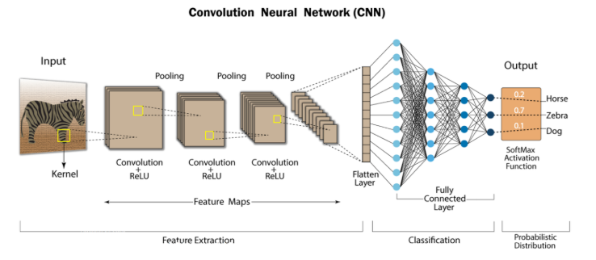
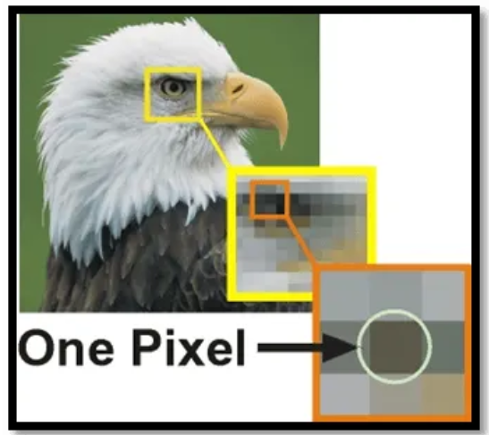
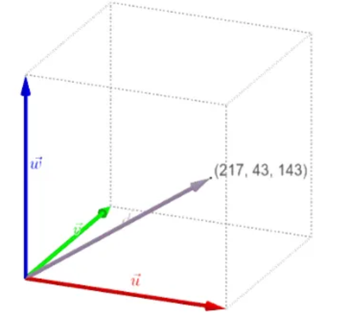
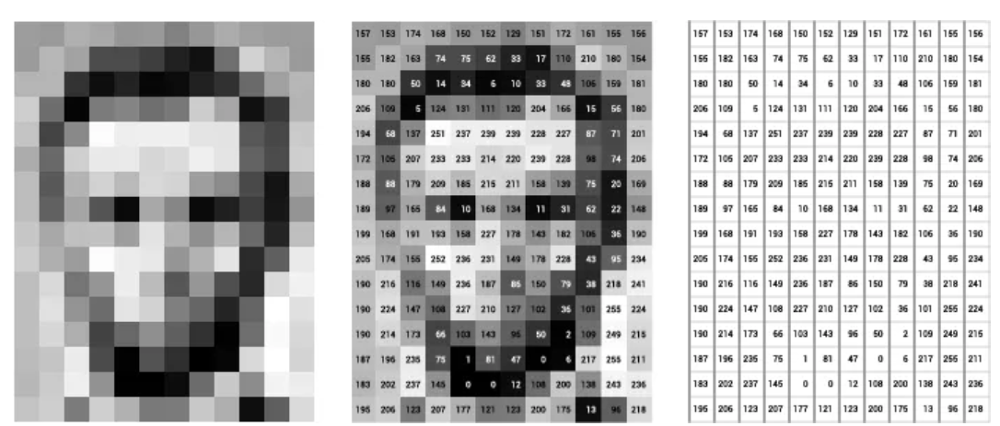
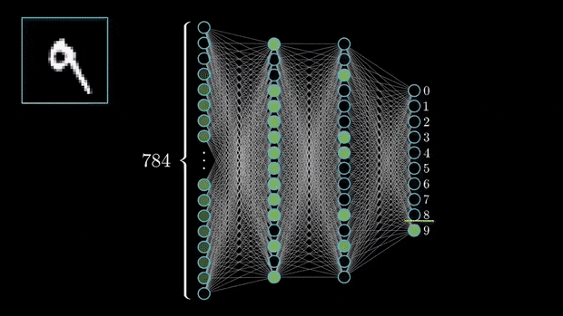
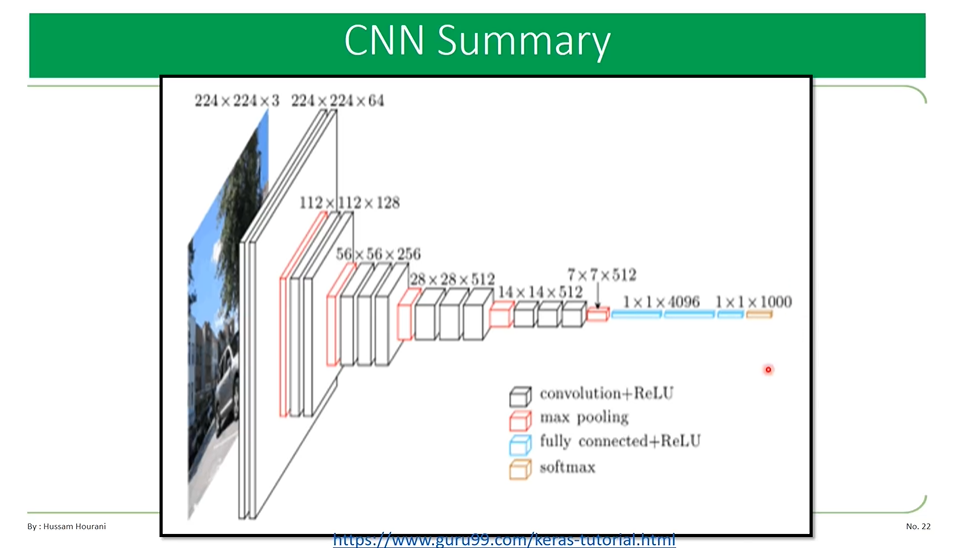

# Course: Convolutional Neural Networks (CNNs)

## Table of Contents

1. Introduction & Motivation  
2. Mathematical Foundations  
   - Convolution Operation  
   - Filters / Kernels  
   - Stride & Padding  
   - Channels / Depth  
3. CNN Architecture Components  
   - Convolutional Layers  
   - Activation Functions  
   - Pooling Layers  
   - Flattening  
   - Fully Connected (Dense) Layers  
4. Training & Backpropagation in CNNs  
5. Implementation Example (TensorFlow / Keras)  
   - Data Preparation  
   - Model Definition  
   - Training & Evaluation  
   - Tips & Best Practices  
6. Advanced Topics & Extensions  
   - Popular Architectures (AlexNet, VGG, ResNet, etc.)  
   - Transfer Learning & Fine-Tuning  
   - Regularization (Dropout, BatchNorm)  
   - Variants (Dilated Convolutions, Depthwise Separable Convs, etc.)  
7. Summary & Further Reading  

---

## 1. Introduction & Motivation

- Convolutional Neural Networks (CNNs), also known as ConvNets, are a class of deep neural networks especially suited for processing grid-like data, most commonly images. :contentReference[oaicite:0]{index=0}  
- They exploit spatial (2D) structure via localized filters, weight sharing, and pooling, allowing them to learn visual patterns (edges, textures, shapes) effectively. :contentReference[oaicite:1]{index=1}  
- Applications include image classification, object detection, segmentation, medical imaging, video analysis, etc. :contentReference[oaicite:2]{index=2}  

### 1.1. Why We Call It Convolutional Neural Network (CNN)

We call it **Convolutional Neural Network (CNN)** because its core operation is the **mathematical convolution**. Let’s unpack that clearly:

---

### 🔹 1. What is Convolution?

In mathematics, a **convolution** is an operation that combines two functions to produce a third one.

In image processing / CNNs, this means:

- One function = **input signal** (the image, represented as pixels)  
- Second function = **kernel/filter** (small matrix of weights)  
- Convolution = **sliding the kernel over the input and computing dot products**

Mathematically, in 2D (image):

\[
S(i,j) = (X * K)(i,j) = \sum_m \sum_n X(i+m, j+n) \cdot K(m,n)
\]

Where:

- \(X\) = input image  
- \(K\) = kernel (filter)  
- \(S\) = output feature map  


### 🔹 2. Why CNNs Use Convolution Instead of Fully Connected Layers

- **Local connectivity**: A pixel is influenced mostly by its nearby neighbors → convolution captures local patterns (edges, corners, textures).  
- **Weight sharing**: The same kernel slides across the image → fewer parameters, more efficient.  
- **Translation invariance**: The same pattern (e.g., an edge) can be detected anywhere in the image.  


### 🔹 3. So Why the Name “Convolutional”?

Because:

- The **main layer type** in these networks is the **convolutional layer**.  
- Instead of generic matrix multiplications (like in dense layers), the network learns by applying **convolutions with filters/kernels**.  
- Thus, the entire architecture inherits the name: **Convolutional Neural Network**.  


#### 🔹 4. Small Analogy

Imagine scanning a picture with a **magnifying glass**:

- The glass (kernel) is the same everywhere.  
- You slide it over the picture (**convolution**).  
- You write down what you see at each spot (**feature map**).  

That *“sliding + combining”* process is the **convolution**.  


### 1.1. pixels
Well… images are also numbers!

Digital images are essentially grids of tiny units called pixels. Each pixel represents the smallest unit of an image and holds information about the color and intensity at that particular point.



Typically, each pixel is composed of three values corresponding to the red, green, and blue (RGB) color channels. These values determine the color and intensity of that pixel.



In contrast, in a grayscale image, each pixel carries a single value that represents the intensity of light at that point.
Usually ranging from black (0) to white (255).



## 2. Mathematical Foundations


### 2.1 Convolution Operation

- The convolution operation between an image region and a filter (kernel) involves element-wise multiplication and summation to produce one scalar — repeated as the filter “slides” over the image. :contentReference[oaicite:3]{index=3}  
- Each position of the filter over the image window yields one output pixel in the feature map. :contentReference[oaicite:4]{index=4}  

### 2.2 Filters / Kernels

- A filter (kernel) is a small matrix (e.g. 3×3, 5×5), whose entries (weights) are learned during training. :contentReference[oaicite:5]{index=5}  
- The same filter is applied across spatial locations (weight sharing), which reduces parameters and enforces translation invariance.  
- For multi-channel images (e.g. RGB), a filter operates across all input channels; the dot product is computed per channel and summed. :contentReference[oaicite:6]{index=6}  

<p align="center">
  
</p>

### 2.3 Stride & Padding

- **Stride**: the step size (in pixels) the filter moves when sliding over the input. A stride of 1 moves one pixel at a time; stride >1 reduces dimension of output. :contentReference[oaicite:7]{index=7}  
- **Padding**: adding extra border (often zeros) around the input to control output size or preserve border information.  
  - *Valid* (no padding) means only positions where the filter fully overlaps are used. :contentReference[oaicite:8]{index=8}  
  - *Same* padding (or “zero-padding”) adds padding so that output spatial size remains same (for stride = 1). :contentReference[oaicite:9]{index=9}  

### 2.4 Channels / Depth (Feature Maps)

- The **input depth** corresponds to the number of channels (e.g. 3 for RGB).  
- Each convolutional layer has multiple filters; each filter produces one output **feature map** (channel). The total number of output channels = number of filters. :contentReference[oaicite:10]{index=10}  
- As the network deepens, width (channel count) typically increases, while spatial dimensions shrink via pooling / striding.

---

## 3. CNN Architecture Components

### 3.1 Convolutional Layers

- These layers apply multiple filters to produce feature maps. Early layers detect low-level features (edges, corners), later layers detect higher-level patterns (textures, object parts). :contentReference[oaicite:11]{index=11}  
- After convolution, an activation function is applied (commonly ReLU).  
- Optionally, batch normalization may follow to stabilize learning.

### 3.2 Activation Functions

- Introduce non-linearity, allowing CNNs to learn complex patterns beyond linear combinations. :contentReference[oaicite:12]{index=12}  
- **ReLU (Rectified Linear Unit)**: \( \mathrm{ReLU}(x) = \max(0, x) \). Very popular due to computational simplicity and improved convergence. :contentReference[oaicite:13]{index=13}  
- Other variants: **Leaky ReLU**, **tanh**, **sigmoid**, etc. :contentReference[oaicite:14]{index=14}  

### 3.3 Pooling Layers


Pooling layers are used in Convolutional Neural Networks (CNNs) to **reduce spatial dimensions** (width × height) of feature maps while retaining the most important information.  

This has several advantages:
- Reduces the **number of parameters** → less computation, faster training.  
- Provides a form of **translation invariance** → small shifts in the image do not drastically change outputs.  
- Prevents **overfitting** by simplifying feature representations.  

Pooling is also called **subsampling** or **downsampling**.

---

#### 🔹 Types of Pooling

##### 1. Max Pooling
- **Definition**: Selects the maximum value from each patch of the feature map.  
- **Why use it**: Keeps the **strongest activation** (most prominent feature, e.g., an edge or corner). Helps detect key patterns regardless of small variations.  
- **Where used**:  
  - Most common pooling method in CNNs.  
  - Effective in tasks like **image classification** and **object detection**, where strong features matter more than weaker ones.  

**Example**:  

##### 2. Average Pooling
- **Definition**: Takes the **average** of all values in each patch.  
- **Why use it**: Retains **overall smooth information**, rather than just the strongest signal.  
- **Where used**:  
  - When preserving **background information** or **general texture** is important.  
  - Used in early CNNs like **LeNet-5**.  
  - Still useful in **medical imaging** or cases where subtle information (not just strong edges) is important.  

**Example**: 

##### 3. Sum Pooling
- **Definition**: Takes the **sum** of all values in the patch.  
- **Why use it**: Retains the **total intensity/energy** of features in the patch.  
- **Where used**:  
  - Less common in modern CNNs.  
  - Sometimes used in **signal processing** or tasks where the **total activation strength** matters.  

**Example**: 

#### 🔹 Summary

| Pooling Type   | What it does | Why use it | Common Use Cases |
|----------------|-------------|------------|------------------|
| **Max Pooling** | Keeps the maximum value | Captures strongest/most important feature | Image classification, object detection |
| **Average Pooling** | Keeps the average value | Preserves smooth background info | Medical imaging, texture analysis |
| **Sum Pooling** | Keeps the sum of values | Captures overall activation energy | Rarely used; some signal processing tasks |


##### **Key Point**:  
Most modern CNNs (like AlexNet, VGG, ResNet) use **Max Pooling** because it highlights the most important features, while **Average Pooling** and **Sum Pooling** are niche but still valuable in specific contexts.


### 3.4 Flattening

- After the convolutional + pooling stages, feature maps (multi-dimensional) are “flattened” into a 1D vector so they can be fed into dense layers. :contentReference[oaicite:18]{index=18}  

### 3.5 Fully Connected (Dense) Layers

- Act similarly to standard neural network layers: every neuron connected to all activations from previous layer. :contentReference[oaicite:19]{index=19}  
- Used at the end to combine extracted features and produce final predictions.  
- The final layer often uses a softmax (for multi-class classification) or sigmoid (for binary) activation. :contentReference[oaicite:20]{index=20}  



## 4. Training & Backpropagation in CNNs

- Training proceeds via **forward pass** (compute outputs) → **compute loss** → **backpropagate gradients** → **update weights** (filters, biases).  
- Backpropagation in CNNs must compute gradients with respect to filter weights, and propagate through convolution, pooling, and activation layers. (The chain rule applies.) :contentReference[oaicite:21]{index=21}  
- Special care:  
  - Strides, padding affect gradient computation  
  - For pooling, gradients route through the “winning” unit (for max-pooling)  
  - Regularization (dropout, weight decay) and batch normalization can be used to improve generalization  

---

## 5. Implementation Example (TensorFlow / Keras)

Below is a skeleton of how one might implement a CNN in TensorFlow / Keras, following the ideas from the “Creating a custom CNN” article. :contentReference[oaicite:22]{index=22}

```python
import tensorflow as tf
from tensorflow.keras import layers, models

# 1. Build the model
def build_cnn(input_shape, num_classes):
    model = models.Sequential()
    # First convolution block
    model.add(layers.Conv2D(filters=32, kernel_size=(3,3), padding='same',
                             activation='relu', input_shape=input_shape))
    model.add(layers.MaxPooling2D(pool_size=(2,2)))
    # Second block
    model.add(layers.Conv2D(filters=64, kernel_size=(3,3), padding='same',
                             activation='relu'))
    model.add(layers.MaxPooling2D(pool_size=(2,2)))
    # Flatten & dense layers
    model.add(layers.Flatten())
    model.add(layers.Dense(units=128, activation='relu'))
    model.add(layers.Dropout(0.5))
    model.add(layers.Dense(units=num_classes, activation='softmax'))
    return model

# 2. Compile & train
model = build_cnn(input_shape=(32,32,3), num_classes=10)
model.compile(optimizer='adam',
              loss='categorical_crossentropy',
              metrics=['accuracy'])

# Suppose you have training & validation datasets: train_ds, val_ds
history = model.fit(train_ds,
                    epochs=20,
                    validation_data=val_ds)

# 3. Evaluate & inference
model.evaluate(test_ds)
```